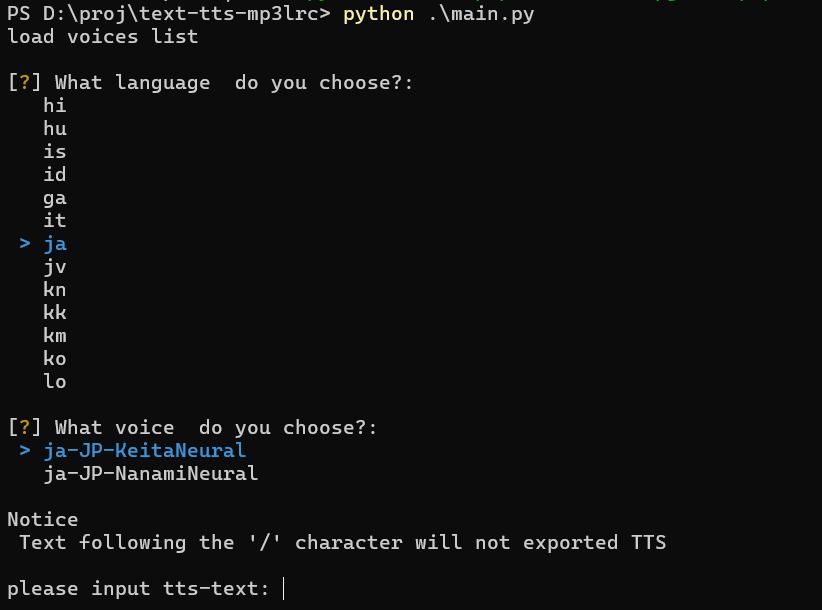
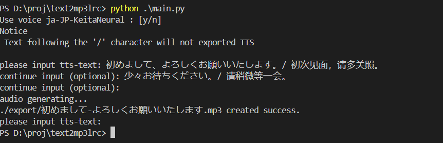

## feature

Convert text to audio(mp3 format ) file with subtitles(.lrc).
this tool is good for foreign language learner 

### install 
pip install -r requirements.txt

git clone https://github.com/junlv/text-tts-mp3lrc

## usage

python main.py  or python3 main.py

input the tts sentence you want (multiple lines allowed), 
type enter key and wait it exporting 
Done! 

## screenshot

